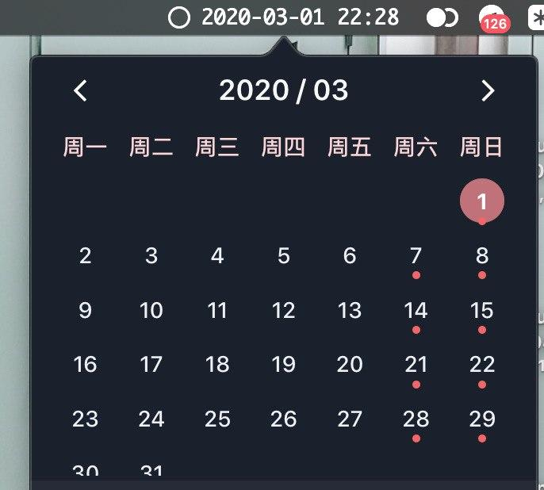

# Sweet Cal

A tiny sweet calendar [Here](http://here.app/) plugin.

## Installation

### One Click  (Recommend)
👉 <a href="https://jump.here.app/?installPlugin?title=SweetCal&url=https://github.com/FriendsOfHere/sweet-cal/releases/latest/download/Sweet-Cal.hereplugin">Click Here 🔌</a>

### Manually
1. Go [releases](https://github.com/FriendsOfHere/sweet-cal/releases/latest/) page
2. Download the latest release & double click the `Sweet-Cal.hereplugin`

### Usage
1. Go preference
2. Custom Your date format. See [Support Format](https://momentjs.com/docs/#/parsing/string-format/)

### License

The plugin is published under the [MIT License](./LICENSE.md)
